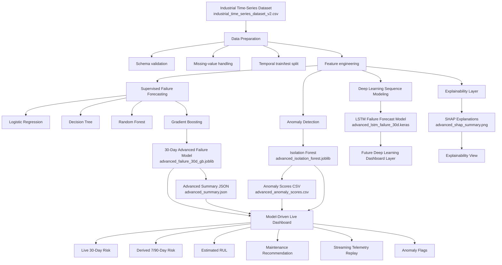

# Advanced Industrial AI Architecture Diagram

## System Overview

## Architecture Narrative

The advanced version of the project follows a layered industrial AI architecture.

### 1. Data Layer
The system starts with a time-series industrial telemetry dataset containing:
- machine identity and operating context
- environmental conditions
- maintenance interval data
- degradation indicators such as vibration, bearing temperature, lubrication, and motor load
- failure forecast labels for 7, 30, and 90 days

### 2. Processing Layer
The data is validated, cleaned, and split using a **time-based holdout strategy**. This is important because predictive maintenance problems must preserve chronology to avoid leakage from future observations.

### 3. Modeling Layer
The project contains four analytical engines:

**A. Supervised Failure Forecasting**  
Multi-horizon failure prediction using:
- Logistic Regression
- Decision Tree
- Random Forest
- Gradient Boosting

**B. Anomaly Detection**  
Isolation Forest is used to detect unusual machine behavior even when a labeled failure is not yet present.

**C. Deep Learning Sequence Modeling**  
An LSTM starter module is included for sequence-based failure forecasting using rolling telemetry windows.

**D. Explainability Layer**  
SHAP is used to explain which features contribute most strongly to model predictions.

### 4. Artifact Layer
The models produce reusable artifacts:
- `advanced_failure_30d_gb.joblib`
- `advanced_isolation_forest.joblib`
- `advanced_anomaly_scores.csv`
- `advanced_summary.json`
- `advanced_shap_summary.png`
- `advanced_lstm_failure_30d.keras`

### 5. Application Layer
These artifacts feed the live Streamlit dashboards:
- failure forecasting dashboard
- factory control room dashboard
- model-driven real-time streaming operations center

### 6. Decision Layer
The application converts AI outputs into operational actions:
- machine risk prioritization
- anomaly flagging
- estimated remaining useful life
- maintenance recommendations
- digital twin style monitoring

## Suggested Figure Caption

**Figure 1.** Advanced industrial AI architecture integrating failure forecasting, anomaly detection, explainability, deep learning, and live dashboard monitoring for predictive maintenance decision support.
